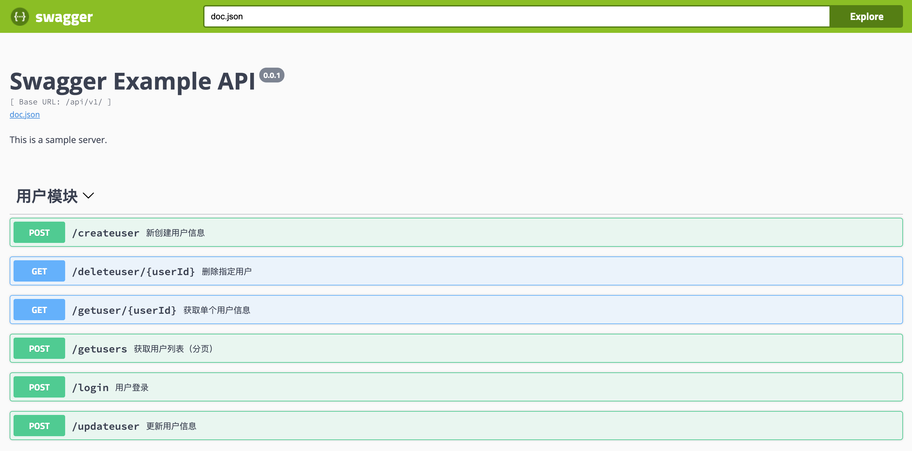

# gin_web_demo

**docker环境**

```dockerfile
➜  ~ docker build -t gin_web_demo:1.0 .
➜  ~ docker run -itd -p 8084:8084 --name gin_web_demo gin_web_demo:1.0
```

**进入到gin_web_demo容器内**

1、修改conf/config.yaml 里的mysql及redis配置

2、执行`./gin_web_demo conf/config.yaml`

3、浏览器打开http://localhost:8084/swagger/index.html即可访问对应的api


